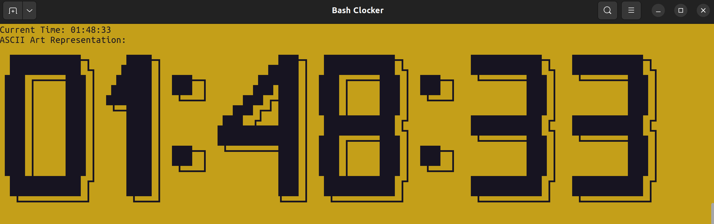

# Bash Clocker

<p align="center">
  
</p>

<p align="center">Screenshot of the Bash Clocker displaying the current time in ASCII art.</p>


The Bash Clocker is a command-line tool designed to display the time, ideal for events or exams, particularly when projected onto a large screen. Utilizing ASCII art, the clocker showcases numbers and characters in an aesthetically pleasing format. With a focus on bash scripting, the project offers customizable displays with more forms planned for future development.

## Table of Contents

- [Introduction](#introduction)
- [Requirements](#requirements)
- [Features](#features)
- [Usage](#usage)
- [License](#license)

## Introduction

The Bash Clocker is a versatile command-line utility crafted to showcase time in a visually appealing manner, particularly suited for events, exams, or any scenario where displaying time is essential. Leveraging the power of ASCII art, the Bash Clocker presents numbers and characters in an engaging format, making it ideal for projection onto large screens or for adding a unique touch to command-line interfaces. When executed, the Bash Clocker opens a new terminal window with dimensions tailored to the specific requirements, determined by the arguments provided during invocation. Developed using bash scripting, the project emphasizes simplicity, flexibility, and ease of use, with plans for further enhancements and additional features in the future.

## Requirements

This project requires the use of a custom terminal profile as a command-line argument when running the shell script. The custom terminal profile determines the appearance and settings of the terminal window in which the script executes. Make sure to have a custom terminal profile configured and provide its name as an argument when running the script.


## Features

- basic
- basic3d

## Usage 

**1.** Clone the Bash Clocker repository.

```terminal
git clone https://github.com/Apisteftos/bash-clocker.git
```
<br>

**2.** Navigate to the project directory.
```terminal 
cd bash-clocker
```

**3.** Run the Bash Clocker script with the required command-line arguments.
```terminal 
./bashclock.sh <feature> <custom terminal profile>

Example: 

./bashclock.sh basic3d CustomYellow

```
<br>
<br>

## License

This project is licensed under the [MIT License](LICENSE).

Please see the [LICENSE](LICENSE) file for the full text of the MIT License.


